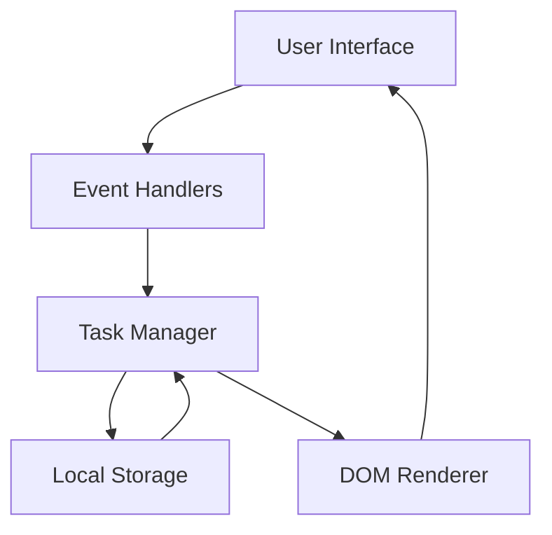

# Design Document

## Overview

The to-do list application will be implemented as a single-page web application using vanilla HTML, CSS, and JavaScript. The design focuses on simplicity, accessibility, and responsive behavior while providing a clean, intuitive user interface for task management.

## Architecture

The application follows a simple client-side architecture with three main layers:

1. **Presentation Layer (HTML/CSS)**: Handles the user interface and visual styling
2. **Logic Layer (JavaScript)**: Manages application state, user interactions, and business logic
3. **Storage Layer (LocalStorage)**: Provides data persistence between browser sessions



## Components and Interfaces

### HTML Structure
- **Container**: Main wrapper for the entire application
- **Header**: Application title and add task form
- **Task List**: Dynamic container for all task items
- **Task Item**: Individual task with checkbox, text, edit input, and delete button
- **Empty State**: Message displayed when no tasks exist

### CSS Classes
- `.todo-container`: Main application wrapper
- `.todo-header`: Header section styling
- `.add-task-form`: Form for adding new tasks
- `.task-list`: Container for all tasks
- `.task-item`: Individual task styling
- `.task-completed`: Styling for completed tasks
- `.task-editing`: Styling for tasks in edit mode
- `.empty-state`: Styling for empty list message

### JavaScript Modules

#### TaskManager Class
```javascript
class TaskManager {
  constructor()
  addTask(description)
  toggleTask(id)
  deleteTask(id)
  editTask(id, newDescription)
  getTasks()
  saveTasks()
  loadTasks()
}
```

#### Task Object Structure
```javascript
{
  id: string,           // Unique identifier
  description: string,  // Task text
  completed: boolean,   // Completion status
  createdAt: Date      // Creation timestamp
}
```

## Data Models

### Task Model
- **id**: Unique identifier (UUID or timestamp-based)
- **description**: String containing the task text (max 500 characters)
- **completed**: Boolean indicating completion status
- **createdAt**: ISO date string for creation time

### Application State
- **tasks**: Array of Task objects
- **editingTaskId**: Currently editing task ID (null if none)
- **nextId**: Counter for generating unique IDs

## Error Handling

### Input Validation
- Empty task descriptions are rejected with user feedback
- Task descriptions are trimmed of whitespace
- Maximum length validation (500 characters)

### Storage Errors
- Graceful fallback when localStorage is unavailable
- Error messages for storage quota exceeded
- Automatic retry mechanism for failed saves

### User Experience
- Visual feedback for all user actions
- Confirmation for destructive actions (optional enhancement)
- Keyboard navigation support (Enter, Escape keys)

## Testing Strategy

### Unit Tests
- Task creation, editing, deletion, and completion
- Local storage save/load operations
- Input validation functions
- Edge cases (empty lists, invalid inputs)

### Integration Tests
- End-to-end user workflows
- DOM manipulation and event handling
- Cross-browser compatibility
- Responsive design validation

### Manual Testing
- Accessibility testing with screen readers
- Keyboard-only navigation
- Mobile device testing
- Performance testing with large task lists

## Implementation Details

### Event Handling
- Form submission for adding tasks
- Click events for task completion and deletion
- Double-click for inline editing
- Keyboard events for edit mode (Enter/Escape)

### DOM Manipulation
- Dynamic task list rendering
- Real-time updates without page refresh
- Efficient re-rendering for large lists
- Accessibility attributes (ARIA labels, roles)

### Responsive Design
- Mobile-first CSS approach
- Flexible layout for different screen sizes
- Touch-friendly interface elements
- Optimized typography and spacing

### Performance Considerations
- Debounced auto-save functionality
- Efficient DOM updates using document fragments
- Minimal CSS and JavaScript footprint
- Lazy loading for large task lists (future enhancement)